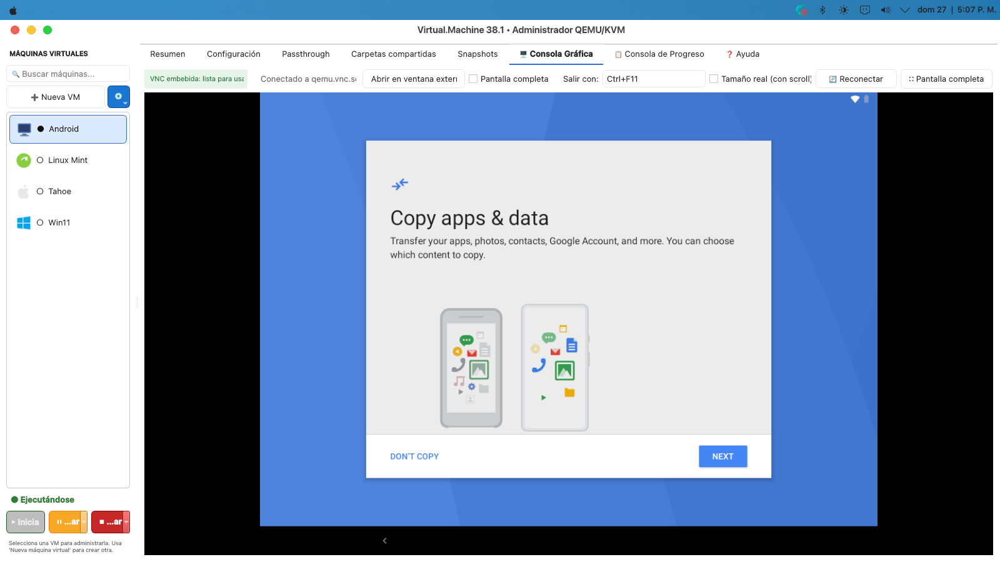
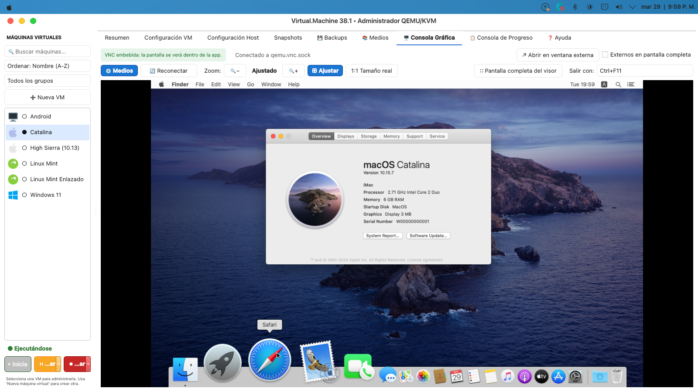
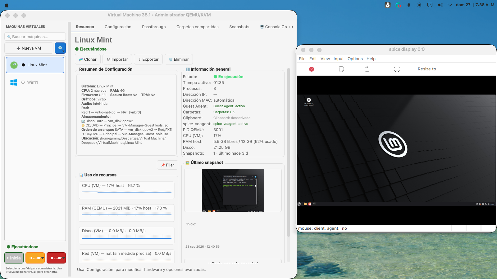
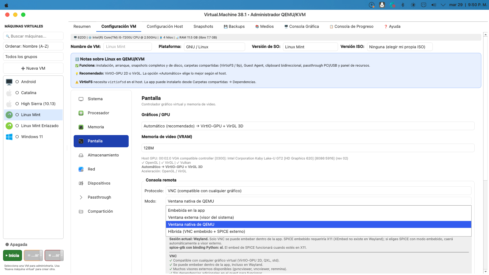
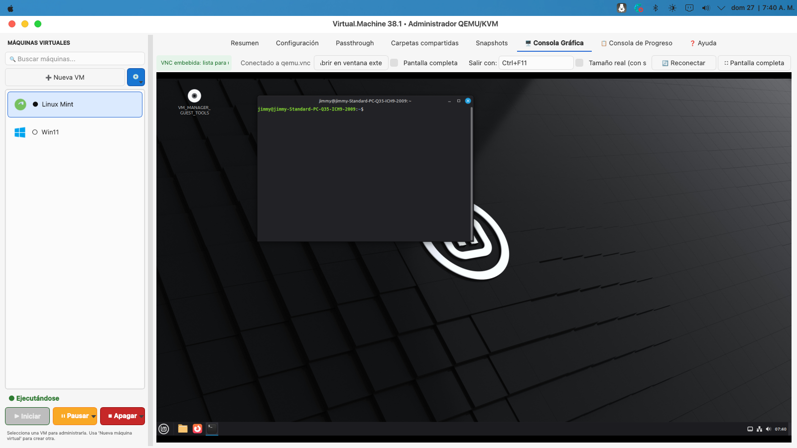
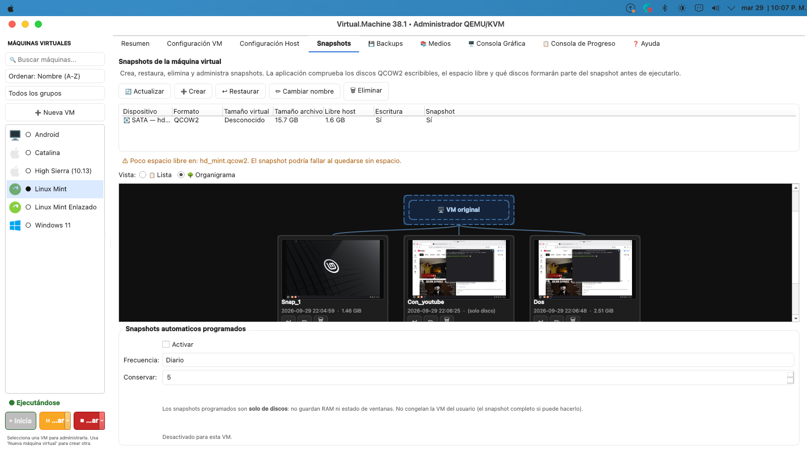

# Virtual.Machine

[](https://www.gnu.org/licenses/gpl-3.0)
[](#plataforma-soportada)
[](https://www.python.org/)
[](https://www.riverbankcomputing.com/software/pyqt/)
[](https://aur.archlinux.org/packages/virtual-machine)

Asistente gráfico para crear y administrar máquinas virtuales con
**QEMU/KVM** en Linux. Interfaz Qt6 con consola VNC/SPICE embebida,
snapshots gráficos, integración con el huésped y soporte para
invitados Linux, Windows, macOS y Android.

---

## Capturas

### Instalacion de Android en curso

<p align="center">
  
</p>

### Instalacion de macOS en curso

<p align="center">
  
</p>

<table>
  <tr>
    <td width="50%"></td>
    <td width="50%"></td>
  </tr>
  <tr>
    <td align="center"><em>Pantalla principal y panel de recursos</em></td>
    <td align="center"><em>Configuracion de la consola VNC/SPICE</em></td>
  </tr>
  <tr>
    <td width="50%"></td>
    <td width="50%"></td>
  </tr>
  <tr>
    <td align="center"><em>Consola VNC embebida dentro de la app</em></td>
    <td align="center"><em>Organigrama de snapshots</em></td>
  </tr>
</table>

---

## Plataforma soportada

**Virtual.Machine funciona únicamente en Linux con KVM.**

Es una decisión de diseño, no una limitación temporal. La aplicación se
apoya en servicios y subsistemas que solo existen en Linux:

| Componente | Depende de |
|---|---|
| Aceleración de hardware | `/dev/kvm` (Linux) |
| Passthrough PCI | VFIO + IOMMU + grupos IOMMU del kernel Linux |
| Passthrough USB sin contraseña | Reglas `udev` |
| Red en modo bridge | `/sys/class/net/<iface>/bridge` |
| Carpetas compartidas VirtioFS | `virtiofsd` del host Linux |
| Métricas de la VM (CPU, RAM, disco, red) | `/proc`, `/sys` |
| Elevación de privilegios | `pkexec` o `sudo` |
| Inhibición de suspensión | `systemd-inhibit` |

En macOS y Windows estos subsistemas no existen (o tienen equivalentes
muy distintos), así que **portar la app no es "cambiar un par de
llamadas"**: requiere reescribir la capa de interacción con el sistema
operativo. Ver la sección *Portabilidad* al final.

> Esta app **no** es un competidor de VirtualBox o VMware. Está pensada
> para el usuario de Linux que quiere controlar QEMU/KVM desde una GUI
> bien cuidada, sin renunciar a las funciones avanzadas del motor.

---

## Requisitos

- **Linux** con kernel 5.10+ (probado en CachyOS, Arch, Ubuntu 22.04+,
  Debian 12+, Fedora 36+).
- **QEMU 6.2+** (`qemu-system-x86_64`, `qemu-img`).
- **KVM** habilitado: `/dev/kvm` accesible y tu usuario en el grupo
  `kvm`. Si no lo esta: `sudo usermod -aG kvm $USER` (requiere cerrar
  sesion). La app avisa con este comando si falta cuando intentes
  arrancar una VM.
- **Python 3.10+**.
- **PyQt6**, `requests`, `packaging` (se instalan automáticamente vía
  `run.sh`).

Opcionales según uso:

- `virtiofsd` para carpetas compartidas rápidas.
- `smbd` (Samba) para carpetas compartidas con Windows/macOS invitado.
- `swtpm` para TPM 2.0 (requerido por Windows 11).
- `dmg2img` para conversión del Recovery de macOS.
- `wmctrl` para subir al frente los visores externos al clic en la VM.
- `spicy` o `remote-viewer` para consola SPICE en ventana externa.
- `gvncviewer`, `vncviewer` o `remmina` para consola VNC en ventana
  externa.

---

## Instalación

<!-- readme_aur_v1 -->

### Arch Linux y derivados (AUR)

El paquete esta publicado en el AUR. Con un helper (`yay`, `paru`):

```bash
yay -S virtual-machine
# o
paru -S virtual-machine
```

Instalacion manual:

```bash
git clone https://aur.archlinux.org/virtual-machine.git
cd virtual-machine
makepkg -s
sudo pacman -U virtual-machine-*.pkg.tar.zst
```

El paquete instala el binario en `/usr/bin/virtual-machine`, el codigo
en `/usr/lib/virtual-machine/` y crea un lanzador en el menu de
aplicaciones. **Las VMs y los recursos descargados (OSX-KVM) viven en
`~/.local/share/virtual-machine/`**, no en `/usr/`.

### Otras distribuciones Linux (desde codigo)

```bash
git clone https://github.com/jverduga1969/virtual-machine.git
cd virtual-machine
./run.sh
```

El script `run.sh` verifica las dependencias de sistema, instala lo que
falta en `~/.local/` (sin tocar el Python del sistema) y arranca la app.
En el primer arranque, la app descarga OSX-KVM (para invitados macOS)
automáticamente si no está presente.

### Uso desde un entorno virtual

```bash
python3 -m venv .venv
source .venv/bin/activate
pip install PyQt6 requests packaging
python3 virtual_machine.py
```

---

### Despues de instalar: preparar el grupo `kvm`

Para aprovechar la aceleracion por hardware (KVM), tu usuario debe
pertenecer al grupo `kvm`:

```bash
sudo usermod -aG kvm $USER
```

Cierra la sesion y vuelve a entrar para aplicar el cambio. La app
detecta automaticamente si el usuario no esta en el grupo y muestra
un aviso con este comando al intentar arrancar una VM.

### Idiomas

La interfaz esta disponible en **6 idiomas**: espanol (fuente), ingles,
frances, portugues (Brasil), italiano y aleman. Cambialo desde el
selector en la esquina superior derecha de las pestanas. Requiere
reiniciar la aplicacion (igual que el cambio de tema).

---
## Funcionalidades

### Gestión de VMs

- Crear, clonar, eliminar VMs con asistente guiado.
- Selección de versión de SO y descarga automática de ISO desde los
  espejos oficiales (Ubuntu, Debian, Fedora, Linux Mint, Arch, openSUSE,
  AlmaLinux, Rocky Linux, Pop!_OS; y Windows retail vía Fido).
- **Android-x86 / Bliss OS**: el usuario aporta la ISO. La app ajusta
  el hardware virtual (BIOS, chipset Q35, SATA/AHCI con degradación
  a IDE si i440FX, red e1000, gráficos QXL 2D) para que arranque sin
  configuración manual.
- Firmware BIOS o UEFI (OVMF), Secure Boot y TPM 2.0.
- Almacenamiento configurable: discos virtuales con distintos formatos
  (QCOW2, RAW, VDI, VMDK), unidades ópticas y orden de arranque.
- Red: múltiples adaptadores con modo NAT, bridge o TAP.
- Passthrough de hardware físico: PCI (VFIO) y USB con hotplug.
- Importar/Exportar VMs (carpeta, `.tar.gz`, `.zip`).

### Consola gráfica

- **VNC embebido** en la app (funciona en X11 y Wayland).
- **SPICE externo** con visor del sistema (`spicy`, `remote-viewer`).
- **Modo híbrido**: VNC dentro de la app + SPICE en ventana externa a
  la vez.
- **Ventana nativa de QEMU**: para gráficos con aceleración 3D
  (VirGL, Venus).
- Atajos globales, modo "tamaño real con scroll", reconexión manual y
  automática.

> Guía detallada: [`README_console.md`](README_console.md).

### Snapshots

- Snapshots de disco y snapshots completos (RAM + dispositivos + discos).
- Vista de organigrama con jerarquía configurable.
- Captura de pantalla automática al crear el snapshot.
- Panel persistente con la miniatura del último snapshot.

### Integración con el huésped

- QEMU Guest Agent.
- Carpetas compartidas VirtioFS/9p/SMB con automontaje.
- Clipboard bidireccional (con SPICE + `spice-vdagent` en el huésped).
- Detección del estado de `spice-vdagent` en el huésped.
- ISO de Guest Tools generada por la app, con scripts de instalación
  para Linux y Windows.

### Notas específicas de Android

- **ISO recomendada**: [Android-x86 9.0](https://www.android-x86.org/download.html)
  (probado). Para **Bliss OS** ([blissos.org](https://blissos.org/))
  se recomienda la variante genérica v15+ —no la «Bliss-Surface», que
  no arranca bajo QEMU—, con **≥8 GB de RAM, 4 núcleos y chipset Q35**.
- **No disponible**: carpetas compartidas (9p / VirtioFS), QEMU Guest
  Agent y clipboard bidireccional. Los kernels de Android-x86 / Bliss OS
  no incluyen esos módulos. Para pasar archivos usa ADB o la red.
- **Gráficos**: la app usa **Red Hat QXL 2D** por defecto, porque
  Android-x86 9.0 (kernel 4.9) no trae driver VirtIO-GPU y caería a un
  shell de rescate con `Detecting Android-x86...`. Las ISOs con kernel
  5.10+ o Bliss OS 15+ sí soportan VirtIO-GPU y se puede elegir a mano.

### Notas específicas de macOS

- **Modelo OSX-KVM**: la instalación de macOS sigue el modelo del
  proyecto OSX-KVM con tres discos: `OpenCore.qcow2` (bootloader en
  modo snapshot, master en `OSX-KVM/`), `BaseSystem.img` (medio de
  instalación, RAW) y `mac_hdd_ng.qcow2` (disco del sistema, QCOW2,
  128 GB). OpenCore es **siempre el primer disco de arranque**.
- **`BaseSystem.img` es opcional**. Solo se necesita si vas a
  instalar macOS desde System Recovery. Si tienes un medio propio
  configurado, o si `mac_hdd_ng.qcow2` ya tiene un sistema instalado
  (más de 2 GB ocupados), la app arranca sin pedir nada. Si no existe
  ninguno de los dos, descarga el Recovery de Apple al pulsar Iniciar.
- **Discos e ISOs adicionales**: los discos y unidades ópticas que
  añadas en Configuración → Almacenamiento se conectan a un **segundo
  controlador AHCI** (`sataext`), sin desplazar los tres discos fijos
  de OpenCore (`sata.2/3/4`).
- **Red**: la NIC se elige automáticamente según la versión. High
  Sierra (10.13) y Mojave (10.14) usan `vmxnet3` (no traen driver
  virtio-net nativo en el instalador); Catalina (10.15) y posteriores
  usan `virtio-net-pci`. La MAC se genera por VM y se conserva entre
  arranques.
- **Gráficos**: macOS **solo funciona con VGA genérico** en QEMU.
  No existe driver nativo para QXL, VMware SVGA II ni VirtIO-GPU. La
  UI bloquea esas opciones en la app con un tooltip explicativo. El
  único modo funcional es **Automático**.
- **Carpetas compartidas**: por SMB (los kernels de macOS no traen
  9p ni VirtioFS).
- **Snapshots**: solo de disco. Los tres discos fijos de OSX-KVM no
  permiten snapshots completos (RAM + dispositivos) sin reescribir
  OSX-KVM.

#### Limitación conocida: High Sierra y Mojave no descargan los paquetes de Apple

Los instaladores de **High Sierra (10.13)** y **Mojave (10.14)** no
consiguen completar las descargas de paquetes desde los servidores de
Apple **desde dentro del guest**. La red funciona (el instalador
alcanza Apple, resuelve DNS, establece la conexión TLS inicial), pero
el proceso se queda a medias cuando empieza a bajar los paquetes
grandes. Causa probable: la pila TLS/certificados de `URLSession` en
versiones antiguas no negocia correctamente con los servidores
modernos de Apple.

**Workaround**: instalar High Sierra o Mojave **offline**, con el
instalador `.app` completo descargado previamente en otro Mac (o desde
Linux con `gibMacOS`). Procedimiento:

1. Descarga `Install macOS High Sierra.app` (o Mojave) en otro Mac, o
   usa [`gibMacOS`](https://github.com/corpnewt/gibMacOS) para bajarlo
   desde Linux.
2. Crea una ISO de arranque con el contenido del `.app` (por ejemplo,
   con `createinstallmedia` de macOS o con `dmg2img` + `mkisofs`).
3. En la VM, monta esa ISO como CD/DVD "Principal" y arranca desde
   ella. El instalador no necesita conectarse a Apple para los
   paquetes; ya vienen en el medio.

**Catalina y versiones posteriores no tienen este problema**: el
instalador baja los paquetes correctamente desde dentro del guest.

### Diagnóstico

- Consola de progreso con filtros por nivel y búsqueda.
- Panel de "Salud de la VM" (procesos, Guest Agent, carpetas).
- Sugerencias contextuales (disco lleno, snapshots antiguos, RAM
  excesiva, PCI sin IOMMU, etc.).
- Watchdog que detecta caídas inesperadas de QEMU y muestra el motivo.

---

## Atajos de teclado

| Atajo | Acción |
|---|---|
| `Ctrl+M` | Abrir menú de Medios (CD/DVD + USB) |
| `Ctrl+R` | Reconectar el widget VNC/SPICE |
| `Ctrl+Alt+C` | Alternar entre Consola Gráfica y la pestaña anterior |

---

## Portabilidad

**¿Por qué solo Linux?** La app depende de subsistemas específicos del
kernel Linux (VFIO, udev, `/proc`, `/sys`, cgroups, `systemd-inhibit`).
Portarla requiere abstraer toda esa capa en una interfaz común
(`HostAdapter`) y escribir una implementación por SO. Ese trabajo **no
está hecho** y no hay plan inmediato de hacerlo.

**¿Y macOS/Windows como huésped?** Eso es distinto y ya está soportado:
puedes instalar macOS (vía OpenCore/OSX-KVM) y Windows como sistema
invitado dentro de la VM sobre un host Linux.

**Si quieres portarla**:

- El camino es empezar por una capa de abstracción (`hosts/base.py`,
  `hosts/linux.py`, `hosts/darwin.py`, …). Está descrito en
  [`CONTRIBUTING.md`](CONTRIBUTING.md).
- Las partes no portables (passthrough PCI, udev, VirtioFS) se
  deshabilitarían en otros SO con un aviso claro.
- Un PR que empiece por la capa abstracta (Fase A) sería muy
  bienvenido, aunque no complete la portabilidad.

---

## Créditos y agradecimientos

Este proyecto no existiría sin el trabajo previo de otros. Gracias a
todos los mantenedores y contribuyentes de los siguientes proyectos:

### Proyectos base

- **[OSX-KVM](https://github.com/kholia/OSX-KVM)** (kholia) — Licencia
  MIT. Base del flujo de virtualización de macOS/OpenCore. La carpeta
  `OSX-KVM/` se descarga automáticamente la primera vez que se ejecuta
  la app.

- **[QEMU](https://www.qemu.org/)** — Licencia GPLv2. Motor de
  virtualización subyacente. La app es un frontend gráfico sobre
  `qemu-system-x86_64`.

- **[pyQVNCWidget](https://github.com/zocker-160/pyQVNCWidget)** —
  Licencia MIT. Widget VNC para Qt del que se tomó la base del cliente
  VNC embebido. Portado a PyQt6 en `vnc_widget/`.

- **[python-xlib](https://github.com/python-xlib/python-xlib)** —
  Licencia LGPL v2.1+. Usado para capturar el teclado a nivel X11
  (Meta/Super, Ctrl+Alt+F*).

- **[spice-gtk](https://www.spice-space.org/)** — Licencia LGPL v2.1+.
  Base del cliente SPICE embebido.

- **[Fido](https://github.com/pbatard/Fido)** (pbatard) — Licencia MIT.
  Script de PowerShell para obtener los enlaces directos oficiales de
  Microsoft a las ISOs retail de Windows.

### Herramientas y librerías

- **[PyQt6](https://riverbankcomputing.com/software/pyqt/)** —
  Licencia GPLv3 o comercial.
- **[Requests](https://requests.readthedocs.io/)** — Licencia Apache 2.0.
- **[packaging](https://github.com/pypa/packaging)** — Licencia
  Apache 2.0 / BSD.

---

## Autoría y uso de IA

- **Autor principal**: Jimmy Verduga.
- **Desarrollo asistido por IA**: este proyecto ha sido desarrollado
  con la asistencia de los modelos **DeepSeek** (uso mayoritario),
  **ChatGPT** (OpenAI) y **Claude** (Anthropic).

### Reparto aproximado del trabajo

- **Diseño, arquitectura y decisiones de producto**: Jimmy Verduga.
- **Especificación de funcionalidades y requisitos**: Jimmy Verduga.
- **Revisión, prueba manual y validación final**: Jimmy Verduga.
- **Generación de código base, refactors y documentación**: asistida
  por IA, revisada y corregida por Jimmy Verduga.
- **Diagnóstico de errores y ajustes iterativos**: repartido entre
  Jimmy Verduga (ejecución y validación) y la IA (análisis y propuesta
  de soluciones).

### Transparencia

La IA se usó como herramienta de apoyo durante el desarrollo, no como
autora del proyecto. Los fragmentos adaptados de otros proyectos están
citados en la sección *Créditos*. El autor asume la responsabilidad
final del código y su comportamiento.

---

## Licencia

Este proyecto se distribuye bajo **GNU General Public License v3.0 o
posterior** (GPLv3+). Consulta el archivo [`LICENSE`](LICENSE) para el
texto completo.

### Por qué GPLv3

La aplicación usa **PyQt6** (Riverbank Computing), cuya licencia es
**dual: GPLv3 o comercial**. Al distribuir el proyecto bajo GPLv3
cumplimos con los términos de la versión gratuita de PyQt6.

Si necesitas integrar partes de este proyecto en software propietario:

1. **Aísla el componente** que te interese y reimplementa sin PyQt6 (o
   usa **PySide6**, que es LGPL).
2. **Adquiere una licencia comercial de PyQt6** y relicencia tu
   derivado como quieras.

### Resumen

- **Puedes**: usar la app, estudiarla, modificarla, redistribuirla,
  empaquetarla para tu distro.
- **Debes**: mantener la atribución y, si redistribuyes una versión
  modificada, publicar el código fuente bajo GPLv3.
- **No puedes**: vender una versión modificada como software
  propietario sin comprar la licencia comercial de PyQt6 o reescribir
  la parte de PyQt6.

---

## Contribuir

Ver [`CONTRIBUTING.md`](CONTRIBUTING.md). Bugs, sugerencias y PRs son
bienvenidos. La suite de tests se ejecuta con:

```bash
./run_tests.sh
```

---

## Enlaces

- [Guía de la consola VNC/SPICE](README_console.md)
- [Changelog de mejoras](CHANGELOG.md)
- [Cómo contribuir](CONTRIBUTING.md)
